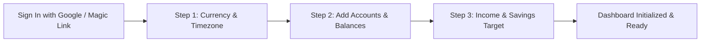
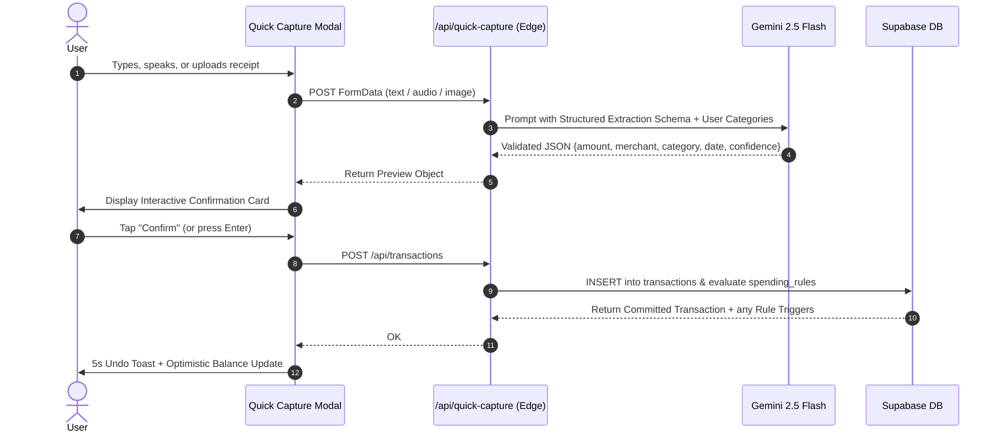

# Product Requirements Document (PRD)

## Product Overview
* **Product Name:** Lumina Money (AI Personal Finance Copilot)
* **One-Line Description:** An intelligent, privacy-first personal finance tracker that combines frictionless multimodal quick-capture with a proactive Gemini-powered financial advisor and conversational rule automation.
* **Product Vision:** Empower solo users to achieve financial clarity and effortless budgeting by eliminating manual logging friction through natural language AI, while maintaining total control over their data, budgets, and automated spending rules.

---

## Problem & Opportunities
1. **High Logging Friction:** Traditional finance trackers require navigating nested menus, picking categories, and typing amounts for every coffee or grocery run. Users burn out after 2 weeks.
2. **Passive, Rearview-Mirror Dashboards:** Existing apps show what you already spent yesterday, but fail to provide actionable, forward-looking advice when you are about to make a purchase decision.
3. **Complex, Clunky Automation Rules:** Most budget tools require users to build complex boolean logic in rigid form builders to categorize expenses. Users want to talk to their app naturally: *"Categorize all Spotify and Netflix charges as Subscriptions."*
4. **Data Privacy & Lock-in Anxiety:** Many personal finance apps monetize user transaction data or hide behind paid subscriptions without offering transparent control. Users want cloud convenience with strict per-user isolation and exportability.

---

## Goal & Success Metrics
### Goals
* Enable users to log an expense in **under 3 seconds** via text, voice, or receipt photo.
* Allow users to set up automated spending and categorization rules purely through **conversational natural language** with the AI Copilot.
* Deliver contextual AI financial advisory grounded strictly in the user's real transactions without hallucinations.
* Provide an adaptive budgeting system that auto-categorizes transactions and enforces user-defined automated rules.

### Success Metrics
* **Logging Velocity:** Average time to log a transaction < 3 seconds.
* **AI Parsing Accuracy:** > 95% zero-edit categorization on natural language and receipt inputs.
* **Conversational Rule Adoption:** > 80% of spending rules created through the AI Copilot chat rather than manual editing.
* **30-Day Retention:** > 60% sustained active logging after 4 weeks.

---

## Target Users
* **Solo Professionals & Freelancers:** Irregular cash flow needing real-time safe-to-spend calculations.
* **Tech-Savvy Budgeters & Vibe Coders:** Users who value clean aesthetics, privacy, keyboard shortcuts, and intelligent automation.
* **Busy Everyday Spenders:** People who want to track expenses on the go without tedious manual entry.

---

## End-to-End User Journeys & Flows

### 1. Authentication & 3-Step First-Run Onboarding Flow
* **Sign-Up / Login:** Google OAuth 2.0 or Email Magic Link powered by Supabase Auth.
* **Onboarding Wizard (Triggered on first sign-in):**
  * **Step 1: Localization & Base Currency:** Select currency (USD `$`, EUR `€`, GBP `£`, JPY `¥`, IDR `Rp`, etc.) and timezone.
  * **Step 2: Accounts & Opening Balances:** Fast-add starting accounts (e.g., Checking `$3,500`, Savings `$10,000`, Credit Card `-$450`, Cash `$120`).
  * **Step 3: Monthly Income & Savings Target:** Set baseline monthly expected income and targeted monthly savings buffer to initialize the **Safe-to-Spend** calculation.
  * **Completion:** User is dropped directly onto their live dashboard with initialized accounts, default system categories, and a welcoming intro message from the AI Copilot.



---

### 2. Multimodal Quick Capture Flow (Day 1 Flagship)
* **Triggers:**
  * Global desktop keyboard shortcut: `Cmd/Ctrl + K` or `Q`.
  * Mobile Floating Action Button (FAB) persistent on the bottom navigation bar.
* **Input Modalities:**
  1. **Natural Language Text:** *"Lunch with team at Chipotle $18.40"*
  2. **Voice Memo:** 1-tap microphone record; audio stream is processed by Gemini multimodal API for single-pass speech-to-intent parsing.
  3. **Receipt Photo Snap / Upload:** Camera snap or image drop; Gemini 2.5 Flash extracts merchant, line items, tax, tip, and total.
* **1-Tap Interactive Confirmation Card:**
  * Displays extracted amount (large tabular font), merchant name, date, auto-selected category pill, and account pill.
  * **Confidence >= 90%:** Shows a prominent `[Confirm (Enter)]` button with 1-tap commit.
  * **Confidence < 90%:** Highlights suggested category with quick alternative pills.
  * **Post-Commit Feedback:** 5-second `[Undo]` toast at the bottom of the screen; dashboard numbers update optimistically in real-time.



---

### 3. Conversational Copilot & Natural Language Rule Setup
* **Access Point:** **Global Slide-Out Drawer** accessible from any screen (desktop top-right or mobile drawer icon), plus proactive alert pills on the dashboard.
* **Conversational Capabilities:**
  * **Financial Advisory:** *"Can I afford a $300 weekend Airbnb trip?"* → AI retrieves current liquid cash, upcoming bill schedules, and monthly budget pace to give an honest, grounded answer.
  * **Spending Analysis:** *"How much did I spend on food delivery this month compared to last month?"* → Deterministic SQL aggregation visualized with inline cards.
  * **Conversational Spending & Categorization Rules (No-Code):**
    * User prompt: *"Whenever I pay at Shell or Chevron, auto-tag it as Gas and put it in Transportation."*
    * AI Copilot triggers Function Calling (`create_spending_rule`):
      ```json
      {
        "name": "Auto-categorize Gas Stations",
        "trigger_condition": { "field": "merchant", "operator": "in", "values": ["Shell", "Chevron"] },
        "action": { "type": "set_category", "category_name": "Transportation / Gas" }
      }
      ```
    * Copilot displays a preview card in the chat: `[Rule Created: Shell/Chevron → Transportation/Gas] [Edit / Undo]`.

---

### 4. Smart Financial Dashboard & Proactive Nudges
* **Safe-to-Spend Metric:** Calculated dynamically:
  $$\text{Safe-to-Spend} = \text{Liquid Cash} - \text{Fixed Recurring Expenses} - \text{Target Savings} - \text{Current Month Spent}$$
* **Visual Data Elements:**
  * **Cash Flow Trend:** Smooth Area Chart (`Recharts`) showing daily cumulative spending vs expected budget trajectory.
  * **Category Breakdown:** Donut Chart with center total spend and top 5 categories + "Other".
  * **Category Burn-Rate Progress Bars:** Color-coded pace meters (<75% green, 75-90% amber, >90% coral red).
* **Proactive Alert Pills:** Non-intrusive glassmorphism banner when an anomaly or rule threshold is crossed (e.g., *"⚡ Dining pace is 35% higher than usual this week"*). Tapping the pill opens the Copilot drawer with context pre-loaded.

---

## Staging & Release Scope

### Day 1 MVP (Scaffolding Target)
* **Auth & Onboarding:** Google OAuth + Email Magic Link + 3-step setup wizard.
* **Ingestion:** Multimodal Quick Capture (Text, Voice audio, Receipt photo) + CSV file import parser.
* **Ledger & Accounts:** Multi-account balances (Checking, Savings, Credit Card, Cash) and interactive transaction table with search and filtering.
* **Copilot Drawer:** Global slide-out drawer with streaming responses and Function Calling for rule creation.
* **Rule Engine:** Server-side evaluation of conversational rules on newly ingested transactions.
* **Dashboard:** Safe-to-Spend gauge, Net Worth card, Category breakdown chart, and Budget progress bars.

### Phase 2 (Follow-up Release)
* **Live Bank Aggregation:** Plaid / SimpleFin integration (schema and mock connector already pre-wired).
* **Recurring Subscriptions Detector:** AI detection of recurring monthly charges and cancellation suggestions.
* **Native Mobile Apps:** Capacitor packaging to generate iOS `.ipa` and Android `.apk` builds.

---

## Out of Scope (Explicitly Excluded)
* Direct automated ACH money transfers or bill payment execution (strictly read-only and advisory).
* Multi-user shared joint accounts / household permissions (deferred to future versions).
* Complex cryptocurrency portfolio tracking and smart contract integrations.
